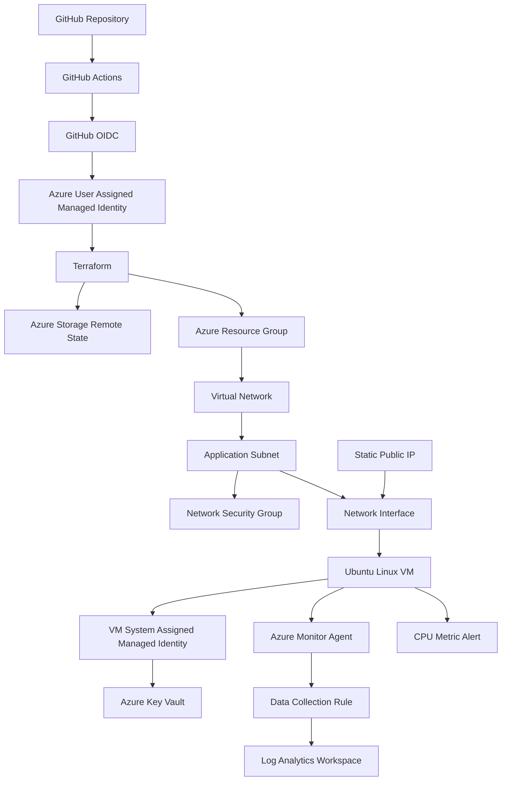

# Enterprise Azure Infrastructure Automation Platform

A production-style Azure infrastructure project built with Terraform and GitHub Actions. The platform provisions and manages secure networking, a Linux virtual machine, identity, secrets access, centralized monitoring, remote Terraform state, and automated CI validation using passwordless GitHub-to-Azure authentication.

## Architecture



## Technologies

- Microsoft Azure
- Terraform
- GitHub Actions
- GitHub OIDC
- Azure CLI
- Ubuntu Linux
- Azure Virtual Network
- Network Security Groups
- Azure Managed Identities
- Azure Key Vault
- Azure Monitor
- Log Analytics
- Azure Storage
- Git
- GitHub

## Infrastructure

The Terraform configuration manages:

- Azure Resource Group
- Virtual Network
- Application Subnet
- Network Security Group
- Restricted SSH rule
- Static Public IP
- Network Interface
- Ubuntu Linux Virtual Machine
- System-assigned Managed Identity
- Azure Key Vault
- Key Vault RBAC assignment
- Log Analytics Workspace
- Azure Monitor Agent
- Data Collection Rule
- VM monitoring association
- CPU utilization alert
- Azure Storage remote Terraform state

## Infrastructure as Code

Terraform is used as the source of truth for the environment.

The project originally began with manually created Azure resources. Those resources were imported into Terraform state and reconciled until Terraform reported:

```text
No changes. Your infrastructure matches the configuration.
```

This demonstrates both brownfield Terraform adoption and ongoing Infrastructure as Code management.

## Remote Terraform State

Terraform state is stored remotely in Azure Blob Storage instead of in the Git repository.

Benefits include:

- centralized state management
- state locking
- CI/CD access to the same state
- prevention of local state files from being committed

Terraform state files are excluded through `.gitignore`.

## GitHub Actions CI/CD

GitHub Actions automatically validates Terraform when infrastructure code changes.

The pipeline performs:

1. Repository checkout
2. Passwordless Azure authentication
3. Terraform setup
4. Terraform initialization
5. Terraform formatting validation
6. Terraform validation
7. Terraform plan
8. Controlled Terraform apply when explicitly requested

## Passwordless Azure Authentication

GitHub Actions authenticates to Azure using OpenID Connect instead of a stored client secret.

Authentication flow:

```text
GitHub Actions
      |
      v
GitHub OIDC Token
      |
      v
Azure Federated Credential
      |
      v
User-Assigned Managed Identity
      |
      v
Azure RBAC
```

This removes the need for long-lived Azure credentials in GitHub.

## Networking

The environment uses:

```text
VNet:        10.10.0.0/16
App Subnet:  10.10.1.0/24
```

The Linux VM is connected through an Azure Network Interface.

Inbound SSH access is controlled through a Network Security Group rule and restricted to an approved source CIDR.

For production use, management access could be further hardened with Azure Bastion, VPN connectivity, or private administration.

## Identity and Key Vault

The Linux VM has a system-assigned managed identity.

Terraform grants the VM the Azure RBAC role:

```text
Key Vault Secrets User
```

at the Key Vault scope.

This allows workloads on the VM to authenticate to Key Vault without embedding credentials in application code.

## Monitoring

The environment includes:

- Azure Monitor Agent
- Log Analytics Workspace
- Data Collection Rule
- Linux Syslog collection
- VM monitoring association
- CPU metric alert

The CPU alert monitors average VM CPU utilization and triggers when utilization exceeds 80 percent.

## Linux Administration

The VM runs Ubuntu Linux and was validated through SSH.

Administration tasks included:

- SSH key authentication
- package updates
- service verification
- hostname inspection
- memory inspection
- disk inspection
- restart validation

## Security Decisions

Security controls implemented in the project include:

- SSH public-key authentication
- restricted SSH source CIDR
- Network Security Groups
- managed identities
- Azure RBAC
- Key Vault
- passwordless GitHub OIDC authentication
- HTTPS-only Terraform state storage
- TLS 1.2 minimum for the state storage account
- public blob access disabled
- Terraform state excluded from Git

## Cost Management

The project was designed around an Azure for Students subscription.

Cost-control decisions include:

- using a small development VM
- deallocating the VM when it is not being used
- using Standard LRS for Terraform state storage
- keeping the environment limited to one development workload
- avoiding higher-cost services such as Azure Bastion

Some resources such as storage, public IP addresses, Log Analytics ingestion, and disks may continue to incur small charges while the VM is deallocated.

## Challenges Solved

### Azure Region Policy

The student subscription restricted deployments to approved Azure regions.

The infrastructure was moved to a permitted region rather than attempting to bypass subscription policy.

### VM SKU Capacity

Several low-cost VM SKUs were unavailable due to regional capacity.

The workload was migrated to Sweden Central where an appropriate VM SKU was available.

### Brownfield Terraform Adoption

Existing Azure resources were imported into Terraform rather than destroyed and recreated.

Configuration differences were reconciled until Terraform produced a clean plan.

### VM Replacement Prevention

Terraform detected a difference between the existing Premium SSD OS disk and the Terraform configuration.

The Terraform configuration was corrected to match the real infrastructure, preventing an unnecessary VM replacement.

### GitHub OIDC Federation

GitHub Actions initially failed Azure authentication because the federated identity subject did not match GitHub's presented OIDC subject.

The Azure federated credential was corrected and passwordless authentication succeeded.

### CI Environment Differences

Terraform originally referenced an SSH public key stored only on the local Windows machine.

The public key was moved into the Terraform configuration directory so GitHub-hosted runners could validate the same configuration.

## Repository Structure

```text
enterprise-azure-infrastructure-platform/
|
├── .github/
│   └── workflows/
│       └── terraform.yml
|
├── docs/
|
├── terraform/
│   ├── azure-infra-dev.pub
│   ├── main.tf
│   ├── outputs.tf
│   ├── platform.tf
│   ├── providers.tf
│   ├── variables.tf
│   ├── versions.tf
│   └── .terraform.lock.hcl
|
├── .gitignore
└── README.md
```

## CI Status

The Terraform GitHub Actions workflow successfully authenticates to Azure using OIDC and completes Terraform initialization, formatting checks, validation, and planning.

## Skills Demonstrated

- Microsoft Azure administration
- Infrastructure as Code
- Terraform resource management
- Terraform import
- remote Terraform state
- Azure networking
- Linux administration
- Azure RBAC
- managed identities
- Key Vault
- Azure Monitor
- Log Analytics
- GitHub Actions
- CI/CD
- OpenID Connect
- troubleshooting
- cloud security
- cost management