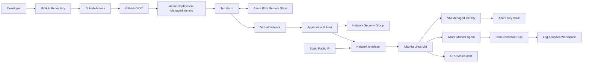

# Architecture

## Platform Flow



## Network Architecture

```text
Azure Virtual Network
10.10.0.0/16
│
└── Application Subnet
    10.10.1.0/24
    │
    ├── Network Security Group
    │   └── Restricted SSH access
    │
    └── Network Interface
        │
        ├── Private IP
        ├── Static Public IP
        │
        └── Ubuntu Linux VM
```

## CI/CD Authentication

```text
GitHub Actions
      │
      │ OpenID Connect
      ▼
GitHub OIDC Token
      │
      ▼
Azure Federated Credential
      │
      ▼
User-Assigned Managed Identity
      │
      │ Azure RBAC
      ▼
Azure Resources
```

No long-lived Azure client secret is stored in GitHub.

## VM Identity

The Ubuntu VM uses a separate system-assigned managed identity.

```text
Ubuntu VM
    │
    ▼
System-Assigned Managed Identity
    │
    │ Key Vault Secrets User
    ▼
Azure Key Vault
```

This provides identity-based access to Key Vault without embedding Azure credentials on the VM.

## Monitoring

```text
Ubuntu VM
    │
    ▼
Azure Monitor Agent
    │
    ▼
Data Collection Rule
    │
    ▼
Log Analytics Workspace
```

Azure Monitor also evaluates VM CPU utilization using a metric alert configured through Terraform.

## Terraform State

Terraform state is stored remotely in Azure Blob Storage.

```text
Developer Terraform ──┐
                      │
                      ▼
                Azure Blob State
                      ▲
                      │
GitHub Actions ───────┘
```

Remote state gives both local Terraform and GitHub Actions access to the same infrastructure state while keeping state files out of Git.